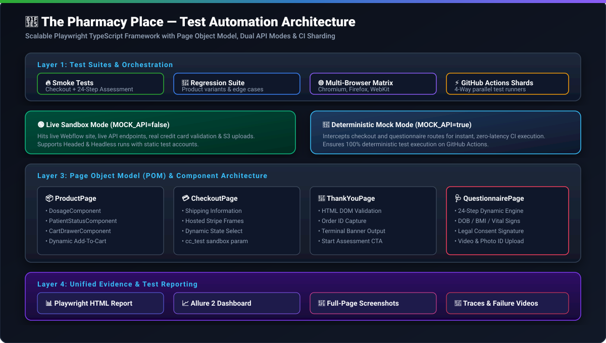

# 🏥 The Pharmacy Place (TPP) — End-to-End Test Automation Framework

<p align="center">
  
  <br/>
  <strong>Production-Grade, Scalable Playwright TypeScript Test Automation Architecture</strong>
  <br/>
  <em>Engineered for E-Commerce Checkout & Complex Multi-Step Health Assessment Automation</em>
</p>

<p align="center">
  <a href="https://github.com/SayanCispl/TPP-Playwright-TS/actions/workflows/playwright.yml"></a>
  
  
  
  
  
</p>

---

## 📑 Table of Contents

- [Overview](#-overview)
- [Key Features](#-key-features)
- [End-to-End User Flow](#-end-to-end-user-flow)
- [Framework Architecture](#-framework-architecture)
- [Project Directory Structure](#-project-directory-structure)
- [Prerequisites & Quick Start](#-prerequisites--quick-start)
- [Environment Configuration](#-environment-configuration)
- [Test Execution Commands](#-test-execution-commands)
- [CI/CD & GitHub Actions Sharding](#-cicd--github-actions-sharding)
- [Reporting & Artifacts](#-reporting--artifacts)
- [Best Practices & Locators Strategy](#-best-practices--locators-strategy)
- [Future Roadmap & Enhancements](#-future-roadmap--enhancements)

---

## 🔭 Overview

This repository houses a **senior-SDET-crafted test automation framework** tailored for **The Pharmacy Place**. It covers the complete prescription medication buying experience:

1. **Product Catalog Selection** (Semaglutide, Tirzepatide, etc.)
2. **Product Configuration** (Patient Status, Dosage selection)
3. **Cart & Sliding Drawer Management**
4. **Custom Checkout with Sandbox Injection**
5. **Order Confirmation & Tracking Key Verification**
6. **24-Step Medical Assessment Questionnaire** (DOB, BMI, Vital Signs, Medical History, Legal Signatures, Video Selfie Upload, and Government Photo ID Verification)
7. **Final Medical Thank You Confirmation**

---

## ⚡ Key Features

- **Page Object Model (POM) + Atomic Components**: Clear separation of concern with dedicated models for checkout, products, and dynamic questionnaire screens.
- **Dual Execution Modes**:
  - **Live Mode (`MOCK_API=false`)**: Runs against live backend and sandbox environments in headed or headless mode.
  - **Mock Mode (`MOCK_API=true`)**: Intercepts network endpoints for rapid, deterministic CI validation without external dependencies.
- **Dynamic Assessment Engine**: An intelligent looping questionnaire processor that handles 24+ distinct question screens, vanillajs-datepickers, radio groups, multi-select cards, and legal signatures.
- **Media Upload Automation**: Handles real video uploads (`.mp4`, `.mov`) and government ID verification (`.jpg`, `.png`).
- **GitHub Actions 4-Way Sharding**: Automated CI pipelines that distribute tests across multiple runner shards and aggregate results into a single unified report.
- **Comprehensive Logging & Evidence**: Structured JSON/Pino logs, order ID terminal summaries, full-page screenshots, video recordings, and Playwright execution traces.

---

## 🔄 End-to-End User Flow

```mermaid
flowchart LR
    A[🛍️ Product Page] -->|Configure Dosage & Status| B[🛒 Cart Drawer]
    B -->|Proceed to Checkout| C[💳 Checkout Page]
    C -->|Fill Shipping & Card| D[🎉 Order Confirmation]
    D -->|Log Order ID & Screenshot| E[📋 Start Assessment]
    E -->|DOB, Gender, Height, Weight, BP| F[🩺 Medical Quiz]
    F -->|Legal Signature & History| G[📹 Video Selfie Upload]
    G -->|Government ID Photo| H[🪪 ID Verification Upload]
    H -->|Submit Complete Assessment| I[✅ Final Thank You Page]
```



---

## 🏛️ Framework Architecture

<p align="center">
  
</p>

---

## 📂 Project Directory Structure

```text
pharmacy-playwright-ts/
├── .agents/                    # AI Agent skills and MCP configurations
├── .github/
│   ├── workflows/
│   │   └── playwright.yml      # CI/CD 4-Way Sharding GitHub Actions workflow
│   └── copilot-instructions.md # Repository AI coding conventions
├── fixtures/                   # Sample test media fixtures
│   ├── test_photo.png          # Lightweight test photo (57 KB)
│   └── test_video.mp4          # Lightweight test video (815 KB)
├── reports/                    # Generated test evidence (git-ignored)
│   ├── allure-results/         # Allure test result JSONs
│   ├── html/                   # Standalone HTML reports
│   └── screenshots/            # Full-page validation screenshots
├── src/
│   ├── config/
│   │   └── environment.ts      # Type-safe environment and credential config
│   ├── data/
│   │   └── product-data.ts     # Data-driven product configuration matrix
│   ├── fixtures/
│   │   └── test-fixture.ts     # Custom Playwright test fixture with POM injection
│   ├── mocks/                  # API network mock handlers & route interceptors
│   ├── models/                 # TypeScript interfaces for forms and assessments
│   ├── pages/                  # Page Object Models & reusable UI components
│   │   ├── base/               # BasePage with core interaction helpers
│   │   ├── checkout/           # Checkout & Payment Page Object
│   │   ├── components/         # Cart Drawer, Dosage, Patient Status components
│   │   ├── product/            # Product catalog page object
│   │   ├── questionnaire/      # 24-Step Medical Assessment Page Object
│   │   └── thank-you/          # Order Confirmation & Order ID capture Page Object
│   └── utils/
│       ├── logger.ts           # Centralized structured Pino logging
│       └── test-data.ts        # Dynamic test data generators
├── tests/
│   ├── edge/                   # Edge case & validation boundary tests
│   ├── regression/             # Comprehensive regression test suite
│   └── smoke/                  # Critical path product checkout & assessment tests
├── .env.example                # Template environment configuration
├── .gitignore                  # Git ignore rules for artifacts and secrets
├── package.json                # NPM scripts and project dependencies
├── playwright.config.ts        # Playwright runner configuration & reporters
└── tsconfig.json               # TypeScript compiler configuration
```

---

## 🚀 Prerequisites & Quick Start

### 1. Prerequisites
- **Node.js**: `v20.x` or `v22.x` (LTS recommended)
- **NPM**: `v10.x` or higher

### 2. Installation
```bash
# Clone the repository
git clone https://github.com/SayanCispl/TPP-Playwright-TS.git
cd TPP-Playwright-TS

# Install Node dependencies
npm install

# Install Playwright browser binaries and system dependencies
npx playwright install --with-deps
```

### 3. Environment Setup
Copy `.env.example` to `.env` and configure your settings:
```bash
cp .env.example .env
```

---

## ⚙️ Environment Configuration

Edit `.env` to configure tests without touching any test code:

| Variable | Description | Default / Example |
| :--- | :--- | :--- |
| `BASE_URL` | Application root URL | `https://the-pharmacy-place.webflow.io` |
| `CHECKOUT_TEST_PARAM` | Query-string parameter for sandbox testing | `sandbox` |
| `MOCK_API` | Set `false` for live server, `true` for mocked network API | `true` |
| `TEST_EMAIL` | Test email used across checkout and assessment | `your-email@example.com` |
| `VIDEO_PATH` | Path to video file for questionnaire selfie upload | `fixtures/test_video.mp4` |
| `PHOTO_PATH` | Path to photo file for ID verification upload | `fixtures/test_photo.png` |
| `WORKERS` | Parallel worker count (leave empty for automatic) | _auto_ |

---

## 🧪 Test Execution Commands

### Live Server Execution (Headed & Headless)
```bash
# Run smoke tests in headed mode on Chromium against the live server
MOCK_API=false npx playwright test tests/smoke --project=chromium --headed

# Run all tests against the live server in headless mode
npm run test:live
```

### Mocked API Execution (Fast & Deterministic)
```bash
# Run all smoke tests with mocked network routes
npm run test:mocked

# Run full test suite across all 3 browsers (Chromium, Firefox, WebKit)
npm test
```

### Targeted & Diagnostic Commands
```bash
# Run specific browser
npm run test:chromium
npm run test:firefox
npm run test:webkit

# Interactive UI Mode
npm run test:ui

# Step-by-Step Playwright Debugger
npm run test:debug

# Re-run only failed tests
npm run test:failed

# TypeScript Typecheck validation
npm run typecheck
```

---

## 🌐 CI/CD & GitHub Actions Sharding

This framework includes an enterprise-grade GitHub Actions workflow (`.github/workflows/playwright.yml`) using **Matrix Sharding**:

1. **Parallel Execution**: Automatically distributes tests across **4 parallel Ubuntu runner shards** (`1/4`, `2/4`, `3/4`, `4/4`).
2. **Deterministic Mock API**: Runs with `MOCK_API: 'true'` to eliminate third-party latency and flakiness.
3. **Automated Blob Merge**: Each shard uploads its `blob-report`, and the `merge-reports` job combines them into a **single unified Playwright HTML report**.

```yaml
# Matrix Sharding configuration in .github/workflows/playwright.yml
strategy:
  fail-fast: false
  matrix:
    shardIndex: [1, 2, 3, 4]
    shardTotal: [4]
```

---

## 📊 Reporting & Artifacts

### 1. Playwright HTML Report
```bash
npm run report
```
Generates an interactive web report with step-by-step traces, failure screenshots, video recordings, and timing metrics.

### 2. Allure Report
```bash
# Generate and open rich Allure dashboard
npm run allure:generate
npm run allure:open
```

### 3. Captured Screenshots & Order Evidence
- **Order Confirmation**: Saved under `reports/screenshots/<product>-<browser>-worker-<id>-checkout-confirmation-<timestamp>.png`
- **Assessment Complete**: Saved under `reports/screenshots/<product>-<browser>-worker-<id>-assessment-complete-<timestamp>.png`

---

## 💡 Best Practices & Locators Strategy

- **Role & Label-First Locators**: Prefers `getByRole()`, `getByLabel()`, and `getByText()` over fragile CSS selectors or XPath.
- **Zero Arbitrary Sleeps**: Uses Playwright's built-in auto-waiting and explicit web assertions (`toBeVisible()`, `toBeEnabled()`, `toBeHidden()`).
- **Dynamic Multi-Screen Handler**: Automatically detects active question types (Date of Birth, Gender, Height/Weight, Blood Pressure, Single/Multi-Choice, Signatures, File Uploads) by querying the visible DOM container.

---

## 🔮 Future Roadmap & Enhancements

- [ ] **Visual Regression Testing**: Integrate `@playwright/test` visual comparisons (`toHaveScreenshot()`) for layout regression detection across viewports.
- [ ] **Accessibility (a11y) Audits**: Automated WCAG 2.1 AA compliance checks using `@axe-core/playwright`.
- [ ] **Lighthouse Performance Benchmarks**: Automated performance, SEO, and Core Web Vitals profiling on checkout pages.
- [ ] **SMS & Email 2FA Automation**: Mailosaur / Twilio API integration for automated one-time passcode (OTP) verification.
- [ ] **Multi-Language / Localization (i18n)**: Locale-based test fixtures for multi-region checkout verification.
- [ ] **AI-Driven Self-Healing Locators**: Integration with Playwright MCP agent for resilient locator healing on DOM changes.

---

<p align="center">
  Crafted with ❤️ by Sayan Koley
</p>
